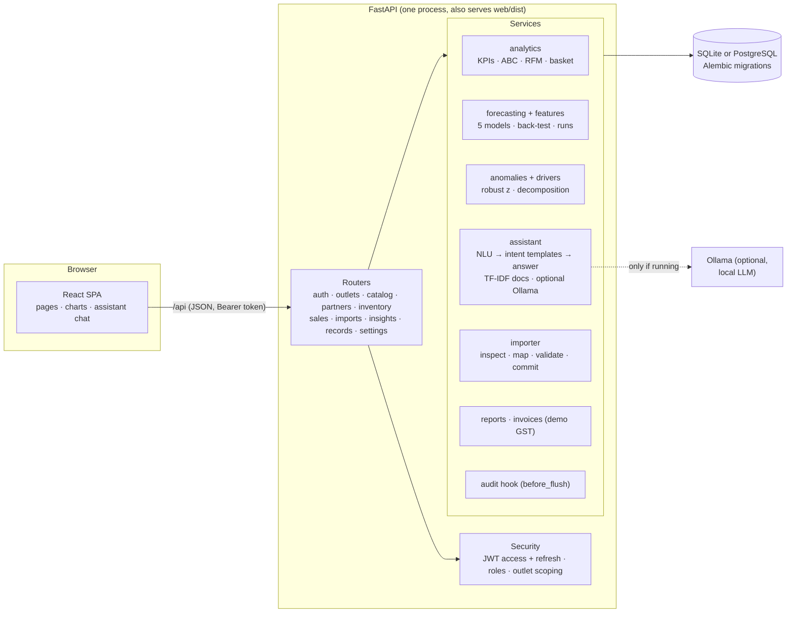
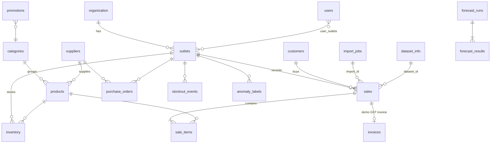
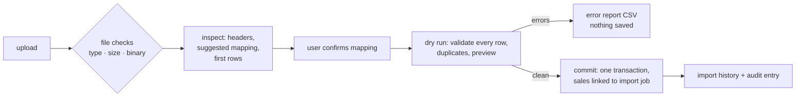
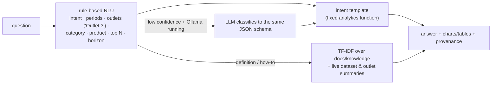

# ERIS architecture and methodology

## System overview

- **One deployable.** In production the API also serves the built web app, so ERIS runs as a single container
  (`docker compose up`). The schema is created and upgraded by Alembic when the app starts.
- **Stateless API.** It uses short-lived access tokens (60 min) and rotating refresh tokens (14 days). Every
  user has a `token_version` counter. Changing a password or choosing "sign out everywhere" increments it,
  which revokes all of that user's refresh tokens.
- **Caching.** Heavy analyses (forecasts, RFM, anomaly detection, driver analysis) are cached in memory
  against a *data version* (sales count, last id, last date), so a new bill or import invalidates them
  automatically.
- **Business clock.** "Today" is computed in the organisation's time zone (`app/clock.py`), not the
  server's.

## Data model (main tables)

| Group | Tables |
|---|---|
| Organisation | `organization` (GSTIN, demo flag, state), `outlets` (state and GST state code, up to 7), `users` and `user_outlets` (many-to-many) |
| Catalogue | `categories`, `products` (SKU, HSN, GST rate, cost, selling price), `suppliers` |
| Operations | `inventory`, `stock_movements` (every stock change), `purchase_orders`, `purchase_order_items`, `customers` (GSTIN, state) |
| Sales | `sales` (source: synthetic, manual or import; `dataset_id`, `import_id`), `sale_items` (list price, promotion, tax and cost snapshot) |
| Demand drivers | `promotions`, `price_history`, `weather_daily`, `stockout_events` |
| Ground truth | `anomaly_labels` (injected anomalies) and `dataset_info` (generator provenance) |
| Models and records | `forecast_runs`, `forecast_results`, `import_jobs`, `invoices`, `audit_log`, `chat_messages` |

**Money.** Selling prices include GST (MRP style). Tax per line = line total × rate / (100 + rate). Gross
profit = revenue − tax − cost of goods.

## Roles and access control

| Role | Can do | Outlets |
|---|---|---|
| admin | Everything: users, settings, outlets, audit log, demo reset | all |
| manager | Stock, purchasing, imports, voids, evaluations, GST summary report | assigned (one or more) |
| staff | Billing (today and yesterday), customers, stock lookup, invoices | assigned |
| viewer | Read-only dashboards, analytics, forecasts, reports and assistant | assigned |

Outlet access is enforced in the application: every endpoint resolves the allowed outlets with
`scoped_outlet_ids()`, and asking for an outlet the user isn't assigned to returns 403. Forecast runs, import
history, invoices, reports and assistant answers are all filtered the same way. Writes use `require_writer`,
`require_manager` and `require_admin`. The UI hides the actions a role can't perform, but the API is the
authority.

## Audit trail

A SQLAlchemy `before_flush` hook records every create, update, delete or void of business records made by a
signed-in user, including who made it and which fields changed (passwords and tokens are never logged).
The record is written in the same transaction as the change. Bulk operations write a single summary entry:
an import, or clearing all transactions. The admin can browse and filter entries on the **Audit log** page.

## CSV import

A real import is all-or-nothing. A bill whose invoice number already exists is skipped with a warning by
default, so the same file can be uploaded twice safely; this can be switched off, in which case the file is
rejected instead.

## Forecasting

**Series:** daily revenue for the whole business, an outlet or a category, or daily units for a product.
History goes back up to 730 days. Horizons are 7, 14 or 30 days in the UI (up to 90 through the API).

| Model | Idea |
|---|---|
| Seasonal naive | Mean of the same weekday over the last 4 weeks. This is the baseline. |
| Holt-Winters | Damped additive trend plus weekly seasonality (statsmodels) |
| XGBoost | Recursive gradient-boosted trees on scale-free weekly lags (7, 14, 21, 28 ÷ 28-day level), calendar, festival and exogenous features |
| Prophet | Weekly and yearly seasonality, the festival calendar as holidays, and promotions, price index, temperature and rain as regressors |
| Ensemble | Mean of the two best non-baseline models in the back-test |

**Features** (`services/features.py`):

- Calendar: day of week, weekend, day of month, month, quarter and day of year as sin/cos.
- Festivals: proximity to each festival, with build-up windows.
- Lags: weekly lags.
- Exogenous: revenue-weighted promotion depth, price index, outlet-weighted maximum temperature and rain, and
  the share of revenue out of stock.

Promotions are planned and future weather uses climatology, so both are known for the forecast window. Future
stockouts are not known, so they are set to zero to avoid leakage.

**Selection.** Each candidate is trained only on data before two consecutive 28-day folds at the end of the
history and scored with WAPE. Prophet is the incumbent. A challenger, including the ensemble, replaces it only
when its WAPE is more than 10% lower. This rule came from the rolling-origin study: picking the minimum on a
single short window chased noise. The chosen model is then refitted on all the data.

**Intervals.** The 80% band comes from the empirical 10th-90th percentiles of the chosen model's relative
back-test errors. Its coverage on the latest fold, using a band estimated on the earlier fold, is reported
alongside the forecast.

**Persistence.** Every forecast request is stored as a `forecast_run` with:

- the series, scope and outlets, horizon and data range;
- the feature list and parameters (selection rule, XGBoost settings, ensemble members);
- the metrics of every candidate (MAE, RMSE, MAPE, sMAPE, WAPE, bias, interval coverage, fit time);
- the selected model, model version, duration and status;
- the forecast values.

Failures are stored with their error and shown as errors; no numbers are made up. The **Model comparison**
page shows the run history and the latest rolling-origin evaluation, which managers can start from the page.
Results are in [FORECAST_EVALUATION.md](FORECAST_EVALUATION.md) and [MODEL_CARD.md](MODEL_CARD.md).

**Stock planning.** Reorder point = demand × lead time + safety stock (1.65 σ √L, about 95% service level).
Order-up-to covers the lead time plus a 7-day review period, and open purchase orders count as incoming stock.
The 14-day stockout-risk list simulates day-by-day stock at the trend-adjusted demand rate, adding open
purchase orders on their expected dates.

## Anomaly detection and driver analysis

**Unusual days** (`services/anomalies.py`):

1. Divide each outlet's daily revenue by its weekday profile.
2. Compare the result with a centred 15-day rolling median to get the expected level.
3. Convert the log ratio of actual to expected into a robust z-score (median and MAD).
4. Flag days where |z| ≥ 3.5. Festival days must reach 6. Open days with zero sales are always flagged.
5. Report drops on heavy-rain days (40 mm or more) as *explained by weather*.

Each flagged day lists its evidence: bills compared with a typical day, a single dominant bill, rain,
promotions, stockouts or a festival. Bill lines with more than 20× the typical quantity are flagged as likely
typing errors. Business and retail bills are compared separately. When labelled anomalies exist, precision and
recall are computed and shown.

**Why revenue changed** (`services/drivers.py`). The change is split exactly into a traffic effect and a
basket effect:

`ΔR = (N1 − N0) · AOV0 + N1 · (AOV1 − AOV0)`

The same change is also broken down by outlet and by category; each breakdown adds up to ΔR. On top of that
the analysis estimates:

- calendar effects (weekday mix and festival lift);
- promotion uplift over the products' normal sales;
- stockout lost sales (days out × normal daily revenue, 40% when a substitute exists);
- rainfall, as an association measured on the past year;
- unusual days.

## AI assistant

- **No free-form SQL.** The question is mapped to an intent and its filters, and one of 29 fixed
  analysis functions runs: the same code that powers the dashboards. Outlet scoping is applied before any query.
- **Provenance on every answer:**
  - data source (counts by source, generator version and seed);
  - filters and exact periods;
  - query time;
  - model version and forecast run id;
  - document sources;
  - insufficient-data notes, for example a period outside the recorded data or an outlet that opened part-way
    through the period.

  Periods are clipped to the last day that has data, so an empty "today" does not distort comparisons.
- **Retrieval (RAG) is limited to project material**: the Markdown files in `docs/knowledge` (glossary,
  forecasting, imports, dataset, anomalies and drivers, invoices, assistant, data dictionary) plus generated
  dataset and outlet summaries. When Ollama is running it may reword retrieved passages, under an instruction
  to use only those passages. Without Ollama the matching sections are quoted directly.
- **Evaluation.** `python -m app.assistant_eval` asks 23 questions and checks the numbers against independent
  SQL; see [ASSISTANT_EVALUATION.md](ASSISTANT_EVALUATION.md).

## Demo GST invoices

- **Seller GSTIN:** each outlet uses the company PAN with the outlet's state code; the checksum is recomputed.
- **Place of supply:** the buyer's GSTIN state, else the customer's state, else the outlet's state.
- **Tax split:** same state as the outlet gives CGST + SGST; a different state gives IGST.
- **Numbering:** `MUMAND/2627/0001`, consecutive per outlet and financial year.
- **PDF:** generated with reportlab, with HSN codes, a tax summary, the amount in words and a *DEMO - NOT FOR
  TAX FILING* watermark. There is no IRN and no filing integration.

## Testing

| Layer | What |
|---|---|
| API (pytest, 87 tests) | Business rules, imports, roles, refresh tokens, audit, invoices, reports, forecasting, anomalies, drivers, assistant. Runs on SQLite and PostgreSQL (CI job `api-postgres`). |
| End-to-end (Playwright, `e2e/`) | Every page as admin; sale → invoice → PDF; import with column mapping; assistant provenance; report downloads; viewer read-only; area manager outlet switching; token refresh; phone layout |
| Model evaluations | `python -m app.evaluation` (forecasting), `python -m app.assistant_eval` (assistant grounding), anomaly precision and recall (Anomalies & drivers page, notebook) |
