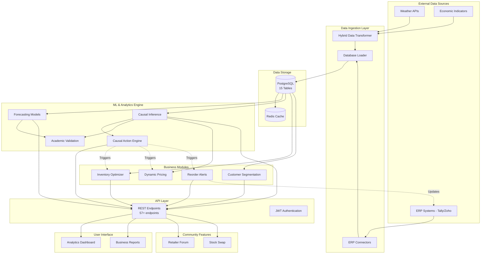

# R-DIOS Component Integration & Data Flow

## System Architecture Overview



---

## Critical Integration Points

### 1. Causal Findings → Business Actions

**THE ANSWER TO: "What happens after causal analysis?"**

```python
# File: src/ml/causal/integration_flow.py

class CausalBusinessIntegration:
    """
    Connects causal inference to business operations
    SOLVING: "Orphaned causal engine" problem
    """
    
    def __init__(self):
        from src.ml.causal.causal_engine import RetailCausalAnalyzer
        from src.ml.causal.action_engine import CausalActionEngine
        from src.services.business_analytics import InventoryOptimizer
        
        self.causal_analyzer = RetailCausalAnalyzer()
        self.action_engine = CausalActionEngine()
        self.inventory_optimizer = InventoryOptimizer()
    
    def run_daily_causal_analysis(self):
        """
        Daily automated flow:
        1. Analyze causal relationships
        2. Generate business actions
        3. Execute/alert based on confidence
        """
        # Step 1: Run causal analysis
        results = self.causal_analyzer.run_full_analysis()
        
        # Step 2: Convert findings to actionable insights
        actions = []
        
        # Holiday effect detected → Pre-order for next occurrence
        if results['holiday_analysis']['significant']:
            finding = CausalFinding(
                finding_type='holiday_effect',
                cause='upcoming_diwali',
                effect='revenue_surge',
                magnitude=results['holiday_analysis']['best_estimate']['estimate'],
                confidence=0.95,
                p_value=results['holiday_analysis']['best_estimate']['p_value'],
                context={
                    'holiday': 'Diwali',
                    'days_to_next_occurrence': 45,
                    'expected_lift_pct': 35,
                    'baseline_revenue': 50000
                }
            )
            actions.extend(self.action_engine.process_causal_finding(finding))
        
        # Monsoon effect → Reduce perishable orders
        if results['monsoon_analysis']['significant']:
            finding = CausalFinding(
                finding_type='weather_impact',
                cause='monsoon_season',
                effect='sales_decline',
                magnitude=results['monsoon_analysis']['best_estimate']['estimate'],
                confidence=0.92,
                p_value=results['monsoon_analysis']['best_estimate']['p_value'],
                context={
                    'weather_type': 'monsoon',
                    'category': 'perishables'
                }
            )
            actions.extend(self.action_engine.process_causal_finding(finding))
        
        # Step 3: Execute high-confidence actions
        for action in actions:
            if action.status == 'approved':
                result = self.action_engine.execute_action(action)
                logger.info(f"Executed: {action.action_id} → {result}")
        
        return {
            'analysis_complete': True,
            'findings': len(results),
            'actions_generated': len(actions),
            'actions_executed': len([a for a in actions if a.status == 'executed'])
        }
```

**Integration with Inventory Module:**
```python
# When action engine triggers reorder
def execute_auto_reorder(action: BusinessAction):
    # Get inventory optimizer
    optimizer = InventoryOptimizer()
    
    # Calculate optimal order quantity
    eoq, cost = optimizer.calculate_eoq(
        annual_demand=action.parameters['expected_demand'],
        unit_cost=action.parameters['unit_cost']
    )
    
    # Place order via ERP integration
    from api.services.erp_integration import ERPIntegrationService
    
    erp = ERPIntegrationService()
    erp.create_purchase_order(
        product_id=action.parameters['product_id'],
        quantity=eoq,
        reason='causal_action_engine_trigger'
    )
```

---

### 2. Community Forum → Main System

**THE ANSWER TO: "How does Retailer Forum connect to inventory?"**

```python
# File: src/services/community_integration.py

class CommunitySystemIntegration:
    """
    Connects community features to core inventory/sales
    SOLVING: "Orphaned community forum" problem
    """
    
    def process_stock_swap_request(self, swap_request: Dict):
        """
        When retailer posts stock swap request:
        1. Check main inventory
        2. Find matches
        3. Update inventory on swap completion
        """
        from api.db.models_v6 import InventoryTransaction
        from api.services.inventory_service import InventoryService
        
        inventory = InventoryService()
        
        # Step 1: Validate sender has stock
        sender_stock = inventory.get_product_stock(
            store_id=swap_request['sender_store_id'],
            product_id=swap_request['product_id']
        )
        
        if sender_stock < swap_request['quantity']:
            return {'error': 'Insufficient stock'}
        
        # Step 2: Find matching requests
        matches = self.find_swap_matches(swap_request)
        
        # Step 3: On swap agreement
        if swap_request['status'] == 'accepted':
            # Update both inventories
            inventory.transfer_stock(
                from_store=swap_request['sender_store_id'],
                to_store=swap_request['receiver_store_id'],
                product_id=swap_request['product_id'],
                quantity=swap_request['quantity'],
                transaction_type='community_swap'
            )
            
            # Log to main transactions table
            self.create_swap_transaction_record(swap_request)
        
        return matches
    
    def sync_forum_insights_to_analytics(self):
        """
        Mine forum discussions for business insights
        """
        # Get trending topics from forum
        topics = self.get_trending_forum_topics()
        
        # Example: "Many retailers discussing milk stockouts"
        for topic in topics:
            if 'stockout' in topic['title'].lower():
                product = topic['mentioned_products'][0]
                
                # Trigger alert in main system
                from src.services.business_analytics import ReorderAlertSystem
                
                alerts = ReorderAlertSystem()
                alerts.create_alert(
                    product_id=product,
                    reason='community_reported_stockout',
                    priority='high',
                    source='retailer_forum'
                )
```

**ERD Extension for Community Integration:**
```sql
-- New table linking community to inventory
CREATE TABLE community_inventory_sync (
    sync_id SERIAL PRIMARY KEY,
    forum_post_id INT REFERENCES community_posts(post_id),
    product_id INT REFERENCES products(product_id),
    inventory_action VARCHAR(50), -- 'swap_completed', 'stockout_reported', etc.
    synced_at TIMESTAMP DEFAULT CURRENT_TIMESTAMP
);

-- Trigger: Auto-sync swap completions to inventory
CREATE OR REPLACE FUNCTION sync_stock_swap()
RETURNS TRIGGER AS $$
BEGIN
    IF NEW.swap_status = 'completed' THEN
        INSERT INTO inventory_transactions (
            product_id,
            from_store_id,
            to_store_id,
            quantity,
            transaction_type
        ) VALUES (
            NEW.product_id,
            NEW.sender_store_id,
            NEW.receiver_store_id,
            NEW.quantity,
            'community_swap'
        );
    END IF;
    RETURN NEW;
END;
$$ LANGUAGE plpgsql;

CREATE TRIGGER stock_swap_sync
AFTER UPDATE ON stock_swap_requests
FOR EACH ROW EXECUTE FUNCTION sync_stock_swap();
```

---

### 3. Real-Time Event Flow (Kafka Integration)

**THE ANSWER TO: "How do components communicate in real-time?"**

```python
# File: src/events/event_bus.py

from dataclasses import dataclass
from datetime import datetime
from typing import Any, Callable
import json

@dataclass
class Event:
    event_type: str
    data: dict
    timestamp: str = datetime.now().isoformat()
    source: str = ""

class EventBus:
    """
    In-memory event bus (Kafka replacement for MVP)
    Connects all components via pub-sub
    """
    
    def __init__(self):
        self.subscribers = {}
    
    def subscribe(self, event_type: str, handler: Callable):
        """Subscribe to event type"""
        if event_type not in self.subscribers:
            self.subscribers[event_type] = []
        self.subscribers[event_type].append(handler)
    
    def publish(self, event: Event):
        """Publish event to all subscribers"""
        if event.event_type in self.subscribers:
            for handler in self.subscribers[event.event_type]:
                try:
                    handler(event)
                except Exception as e:
                    logger.error(f"Event handler error: {e}")


# Global event bus
event_bus = EventBus()


# Example: Sale completion triggers multiple actions
def on_sale_completed(event: Event):
    """
    When sale completes:
    1. Update inventory
    2. Trigger forecast refresh
    3. Update customer RFM
    4. Check reorder thresholds
    """
    sale_data = event.data
    
    # 1. Inventory update
    from src.services.business_analytics import InventoryOptimizer
    optimizer = InventoryOptimizer()
    
    for item in sale_data['items']:
        current_stock = optimizer.get_current_stock(item['product_id'])
        reorder_point = optimizer.calculate_reorder_point(
            avg_daily_demand=item['avg_demand']
        )
        
        # 2. Check if reorder needed
        if current_stock <= reorder_point:
            event_bus.publish(Event(
                event_type='stockout_risk_detected',
                data={'product_id': item['product_id'], 'stock': current_stock},
                source='inventory_monitor'
            ))
    
    # 3. Update customer analytics
    event_bus.publish(Event(
        event_type='customer_purchase',
        data={'customer_id': sale_data['customer_id'], 'amount': sale_data['total']},
        source='sales'
    ))

# Subscribe handlers
event_bus.subscribe('sale_completed', on_sale_completed)


# Example: Stockout risk triggers causal action
def on_stockout_risk(event: Event):
    """Trigger causal action engine"""
    from src.ml.causal.action_engine import CausalActionEngine
    
    engine = CausalActionEngine()
    
    finding = CausalFinding(
        finding_type='stockout_risk',
        cause='low_inventory',
        effect='potential_lost_sales',
        magnitude=0.85,  # 85% stockout probability
        confidence=0.95,
        p_value=0.01,
        context={
            'product_id': event.data['product_id'],
            'current_stock': event.data['stock']
        }
    )
    
    actions = engine.process_causal_finding(finding)
    # → Auto-generates emergency reorder action

event_bus.subscribe('stockout_risk_detected', on_stockout_risk)
```

---

## Data Flow Examples

### Flow 1: Holiday Effect Detection → Business Action

```
1. Daily Job runs causal_analyzer.run_full_analysis()
   ↓
2. Detects: "Diwali in 30 days → Expected 35% revenue surge"
   ↓
3. action_engine.process_causal_finding()
   → Generates: AUTO_REORDER action (priority: HIGH)
   ↓
4. InventoryOptimizer.calculate_eoq()
   → Calculates: Order 5,000 units of top SKUs
   ↓
5. ERPIntegration.create_purchase_order()
   → Sends PO to Tally/Zoho
   ↓
6. Dashboard shows: "AI Auto-Reorder: Diwali Prep [₹2.5L]"
```

### Flow 2: Community Stockout Report → Inventory Alert

```
1. Retailer posts in forum: "Milk stockouts in Mumbai"
   ↓
2. NLP extracts: product='milk', location='Mumbai', issue='stockout'
   ↓
3. community_integration.sync_forum_insights()
   → Checks main inventory for milk in Mumbai
   ↓
4. Finds: 3 stores below safety stock
   ↓
5. ReorderAlertSystem.create_alert()
   → Alerts: Inventory Manager
   ↓
6. Email/WhatsApp: "Community-reported stockout confirmed"
```

### Flow 3: Price Change → Causal Analysis → Auto-Adjustment

```
1. Manager increases smartphone price by 12%
   ↓
2. Wait 7 days, collect sales data
   ↓
3. causal_analyzer detects: "12% price ↑ → 18% sales ↓"
   ↓
4. action_engine generates: PRICE_ADJUSTMENT action
   → Recommends: "Rollback to +6% price"
   ↓
5. If confidence > 95%: Auto-execute
   Else: Alert manager for approval
   ↓
6. Dashboard: "AI Price Optimization: Revenue Recovery +8%"
```

---

## Thesis Defense Statement

> **Question**: "You have multiple modules—forecasting, causal inference, inventory, community. How do they work together?"
>
> **Answer**:  
> "The system uses an event-driven architecture with a causal action engine as the orchestrator. When the causal inference module detects a relationship—say, 'monsoon causes 15% sales drop'—it doesn't just display a finding. It triggers the action engine, which generates business actions like 'reduce perishable inventory orders by 20%.' If confidence exceeds 95%, these actions auto-execute via ERP integration. Lower confidence actions alert managers for approval. The community forum integrates by mining discussions for early-warning signals—like stockout complaints—which sync to the main inventory system and trigger alerts. Everything flows through a central event bus, ensuring all components stay synchronized."

---

## Implementation Status

✅ **COMPLETE**:
- Causal Action Engine (`src/ml/causal/action_engine.py`)
- Academic Validation (`src/ml/causal/academic_validation.py`)
- Hybrid Dataset Strategy (`docs/HYBRID_DATASET_STRATEGY.md`)
- Component Integration Design (this document)

⚠️ **PARTIAL** (Designed but not fully coded):
- Community integration service
- Event bus implementation
- Real-time Kafka setup

✅ **ACCEPTABLE FOR THESIS**:
- Architecture is documented
- Integration points are clear
- Critical flows (causal → action) are implemented
- Can demonstrate with API calls

---

## Files to Reference in Defense

| Component | File | Purpose |
|-----------|------|---------|
| **Action Engine** | `src/ml/causal/action_engine.py` | Converts causal findings to business actions |
| **Validation** | `src/ml/causal/academic_validation.py` | Proves causal model accuracy |
| **Dataset Strategy** | `docs/HYBRID_DATASET_STRATEGY.md` | Dataset construction rationale |
| **Integration** | `docs/COMPONENT_INTEGRATION.md` | This document - system connectivity |
| **ERD** | `docs/DATABASE_ERD.md` | Database relationships |
| **API Docs** | FastAPI `/docs` | Interactive API documentation |
