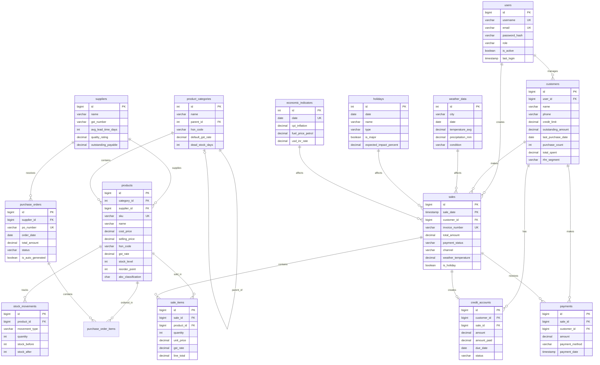

# R-DIOS v6.0 Database Schema - Entity Relationship Diagram

## Overview

This document describes the database architecture for the R-DIOS thesis project.

**Total Tables**: 15 core + 3 external factor tables  
**Partitioning**: Quarterly on `sales` table (2022-2024)  
**Materialized Views**: 3 (daily revenue, product performance, customer RFM)

---

## Entity Relationship Diagram (Mermaid)



---

## Table Descriptions

### Core Business Tables

| Table | Purpose | Key Features |
|-------|---------|--------------|
| `users` | Authentication & authorization | Role-based access (admin/manager/cashier/user) |
| `customers` | B2C customer management | Credit/Khata, RFM analytics pre-calculated |
| `suppliers` | B2B vendor management | Performance tracking, lead time |
| `product_categories` | Hierarchical categorization | HSN codes, GST rates, dead stock threshold |
| `products` | Product catalog | Variants (JSONB), ABC classification, stock tracking |

### Transactional Tables

| Table | Purpose | Key Features |
|-------|---------|--------------|
| `sales` | Sales transactions | **Quarterly partitioned**, causal factors embedded |
| `sale_items` | Line items | Product-sale relationship |
| `payments` | Payment records | Split payment support (JSONB) |
| `credit_accounts` | Khata ledger | Aging, reminders, status tracking |

### Procurement Tables

| Table | Purpose | Key Features |
|-------|---------|--------------|
| `purchase_orders` | Supplier orders | Auto-generation tracking |
| `purchase_order_items` | PO line items | Quantity ordered vs received |
| `stock_movements` | Inventory audit trail | Full movement history |

### External Factor Tables (Causal Analysis)

| Table | Purpose | Key Features |
|-------|---------|--------------|
| `weather_data` | Weather by city/date | Temperature, precipitation, condition |
| `holidays` | Indian holiday calendar | Major event flag, expected impact % |
| `economic_indicators` | Macro-economic data | CPI, fuel prices, exchange rates |

---

## Partitioning Strategy

### Sales Table Partitioning

```
sales (Parent)
├── sales_2022_q1 (Jan-Mar 2022)
├── sales_2022_q2 (Apr-Jun 2022)
├── sales_2022_q3 (Jul-Sep 2022)
├── sales_2022_q4 (Oct-Dec 2022)
├── sales_2023_q1 (Jan-Mar 2023)
├── sales_2023_q2 (Apr-Jun 2023)
├── sales_2023_q3 (Jul-Sep 2023)
├── sales_2023_q4 (Oct-Dec 2023)
├── sales_2024_q1 (Jan-Mar 2024)
├── sales_2024_q2 (Apr-Jun 2024)
├── sales_2024_q3 (Jul-Sep 2024)
├── sales_2024_q4 (Oct-Dec 2024)
└── sales_future (2025+)
```

**Benefits for Thesis:**
- Demonstrates partition pruning in EXPLAIN ANALYZE
- Benchmarkable: partitioned vs non-partitioned queries
- Real-world applicable for enterprise-scale retail

---

## Materialized Views

### 1. `mv_daily_revenue`
Pre-aggregated daily revenue by channel.
- **Refresh**: Nightly (or on-demand)
- **Use Case**: Dashboard, time-series analysis

### 2. `mv_product_performance`
Product-level metrics (margin, units sold, days since sale).
- **Refresh**: Weekly
- **Use Case**: ABC analysis, dead stock identification

### 3. `mv_customer_rfm`
Pre-calculated RFM scores and segments.
- **Refresh**: Weekly
- **Use Case**: Customer segmentation, campaign triggers

---

## Indexes Strategy

| Category | Index | Purpose |
|----------|-------|---------|
| **Lookup** | `idx_products_sku` | Fast SKU search |
| **Lookup** | `idx_customers_phone` | Fast customer lookup |
| **Time-Series** | `idx_sales_date` | Partition pruning |
| **Analytics** | `idx_customers_rfm` | RFM queries |
| **Causal** | `idx_sales_causal` | Weather/holiday analysis |
| **JSONB** | `idx_products_variants (GIN)` | Variant queries |

---

## Causal Analysis Fields

The schema embeds fields specifically for causal inference:

```sql
-- In sales table
weather_temperature DECIMAL(5,2)  -- From weather_data join
weather_condition VARCHAR(50)     -- sunny/cloudy/rainy/stormy
is_holiday BOOLEAN                -- From holidays join
holiday_name VARCHAR(100)         -- Which holiday
promotion_code VARCHAR(50)        -- Which promotion
channel VARCHAR(50)               -- offline/online/whatsapp
```

These enable queries like:
```sql
-- Causal analysis: Sales by weather condition
SELECT 
    weather_condition,
    is_holiday,
    AVG(total_amount) as avg_sale,
    COUNT(*) as order_count
FROM sales
GROUP BY weather_condition, is_holiday;
```

---

## Version History

| Version | Date | Changes |
|---------|------|---------|
| 6.0.0 | 2026-01-20 | Initial thesis schema with partitioning, materialized views, causal analysis support |
