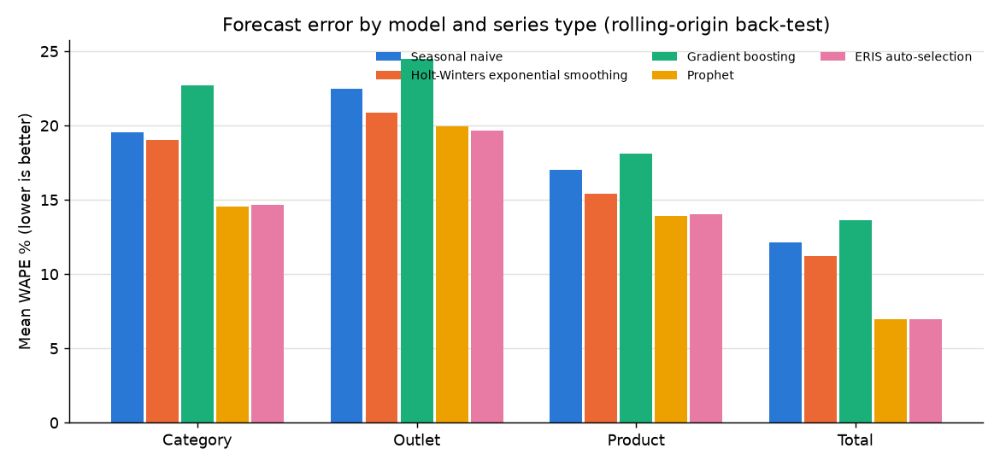
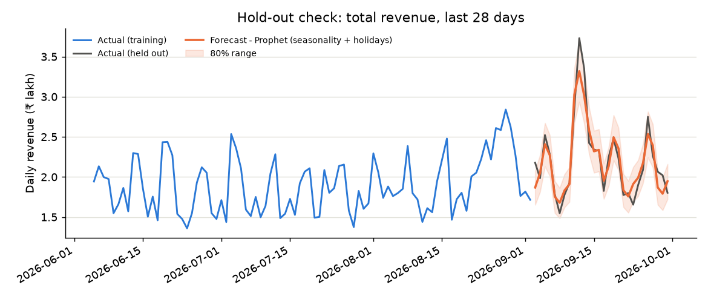

# Forecast model evaluation

Generated with `python -m app.evaluation` on the demo dataset: 26 series (total, outlets, categories, top products), 3 forecast origins each, 28-day horizon - 390 model runs. Every model is trained only on data before each origin.

## Mean WAPE (%) by series type

| model                              |   category |   outlet |   product |   total |   all series |
|:-----------------------------------|-----------:|---------:|----------:|--------:|-------------:|
| Seasonal naive                     |      19.54 |    22.45 |     17.03 |   12.15 |        18.96 |
| Holt-Winters exponential smoothing |      19.02 |    20.86 |     15.4  |   11.22 |        17.76 |
| Gradient boosting                  |      22.73 |    24.51 |     18.12 |   13.64 |        21.02 |
| Prophet                            |      14.52 |    19.93 |     13.93 |    6.99 |        15.25 |
| ERIS auto-selection                |      14.66 |    19.65 |     14.02 |    6.99 |        15.27 |

- **ERIS auto-selection: 15.3% WAPE** vs 19.0% for the seasonal-naive baseline (19% lower error).
- Best single model overall: **Prophet** (15.2%).
- Product-level series are noisier (small daily counts), so their errors are naturally higher than revenue series that aggregate many products.

## How often each model was the most accurate

| model                              |   wins |
|:-----------------------------------|-------:|
| Prophet                            |     54 |
| Holt-Winters exponential smoothing |     13 |
| Gradient boosting                  |      7 |
| Seasonal naive                     |      4 |

## What auto-selection picked

| chosen                             |   times chosen |
|:-----------------------------------|---------------:|
| Prophet                            |             72 |
| Holt-Winters exponential smoothing |              2 |
| Seasonal naive                     |              2 |
| Ensemble                           |              2 |

## Method

- **WAPE** = Σ|actual − forecast| ÷ Σ actual. Unlike MAPE it is stable when some days have tiny sales.
- **Rolling origin**: origins are spaced one horizon apart, ending at the last day of data, so each test window is unseen by the model.
- **Auto-selection** reproduces production exactly: it back-tests candidates on the last 4 weeks of its own training data and refits the winner (or an ensemble of the best two).
